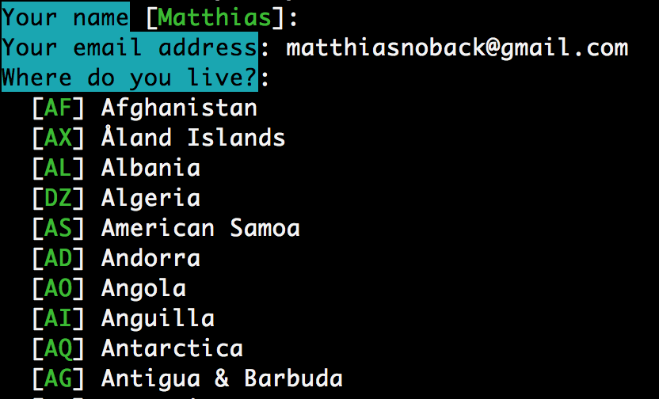

# Symfony Console Form

By Matthias Noback

This package contains a Symfony bundle and some tools which enable you to use Symfony Form types to define and
interactively process user input from the CLI.

# Installation

    composer require matthiasnoback/symfony-console-form

Enable `Matthias\SymfonyConsoleForm\Bundle\SymfonyConsoleFormBundle` in the kernel of your Symfony application.

# Usage

Follow the steps below or just clone this project, then run:

    php test/console.php test

## Set up the form

```php
<?php

use Symfony\Component\Form\AbstractType;
use Symfony\Component\Form\FormBuilderInterface;
use Symfony\Component\OptionsResolver\OptionsResolverInterface;
use Symfony\Component\Validator\Constraints\Country;
use Symfony\Component\Validator\Constraints\Email;

class TestType extends AbstractType
{
    public function buildForm(FormBuilderInterface $builder, array $options)
    {
        $builder
            ->add(
                'name',
                'text',
                [
                    'label' => 'Your name',
                    'required' => true,
                    'data' => 'Matthias'
                ]
            )
            ...
        ;
    }

    public function setDefaultOptions(OptionsResolverInterface $resolver)
    {
        $resolver->setDefaults(['data_class' => 'Matthias\SymfonyConsoleForm\Tests\FormData']);
    }

    public function getName()
    {
        return 'test';
    }
}
```

The corresponding `FormData` class looks like this:

```php
<?php

class FormData
{
    public $name;
    ...
}
```

## Create the console command

You only need to implement `FormBasedCommand`:

```php
<?php

use Symfony\Component\Console\Command;
use Symfony\Component\Console\Input\InputInterface;
use Symfony\Component\Console\Output\OutputInterface;
use Matthias\SymfonyConsoleForm\Console\Command\FormBasedCommand;

class TestCommand extends Command implements FormBasedCommand
{
    protected function configure()
    {
        $this->setName('test');

        // you don't need to configure any options here, this is all taken care of
    }

    protected function formType()
    {
        // return the form type (can be a string) which should be used for interaction with the user

        return new TestType();
    }

    protected function execute(InputInterface $input, OutputInterface $output)
    {
        $formData = $this->formData();

        // $formData is the valid and populated form data object
        ...
    }
}
```

Then run `app/console test` and you'll see the following interaction:



When you provide command-line options with the names of the form fields, those values will be used as default values.

If you add the `--no-interaction` option when running the command, it will submit the form using the input options you provided.

If the submitted data is invalid the command will fail.

# TODO

- Provide example of stand-alone usage (no need to extend the command)
- Maybe: provide a way to submit a form at once, possibly using a JSON-encoded array
- Handle invalid form data (maybe in a loop)
- Add functional tests
- Rename and document the console helper
- When these things have been provided, release this as a package (or multiple packages for stand-alone use)
